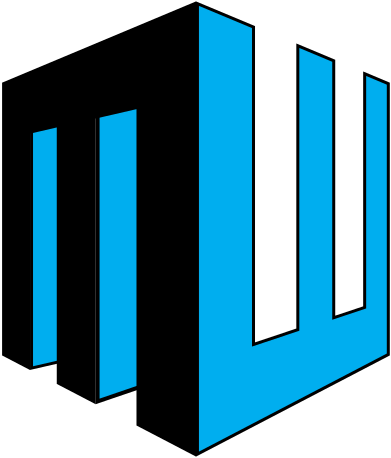

<p align="center">
  
</p>

# Maxlew Video System: lathund

Med Maxlew Video System ser du bilden från en eller flera kameror **med fördröjning** (delay). Du kan till exempel se vad som hände för 10 sekunder sedan, direkt på skärmen.

Systemet styrs helt med tangentbordet. Det numeriska tangentbordet räcker för det mesta.

---

## 1. Starta systemet

1. Tryck på datorns strömknapp.
2. Vänta. Systemet startar av sig självt: först visas Maxlew-loggan med en ljudsignal, därefter **huvudmenyn**.

Du behöver inte logga in eller starta något program.

## 2. Tangenterna

| Tangent | Vad den gör |
| --- | --- |
| **Siffror** (1, 2, 3 ...) | Väljer i menyerna |
| **Enter** | Bekräftar det du har skrivit eller valt |
| **+** | **Tillbaka till huvudmenyn.** Fungerar på alla sidor, även när du tittar på video |
| **\*** | Stänga av systemet (bara i huvudmenyn) |

> Tips: Kommer du vilse, tryck **+** så är du tillbaka i huvudmenyn.

## 3. Huvudmenyn

```
Huvudmeny
  1. Singlecam
  2. Singlecam Quadview
  3. Doublecam
  *. Stäng av systemet
```

Tryck på siffran för det du vill göra.

## 4. Delay och timglaset

**Delay** är hur många sekunder senare du vill se bilden. Skriver du 10 ser du det som hände för 10 sekunder sedan.

* Längsta delay är **36 sekunder**. Skriver du in ett högre tal används 36.
* Delay **0** betyder direktbild, utan fördröjning.
* När du har valt en delay visas ett **timglas** som räknar ned sekunderna. Det är normalt: systemet behöver först spela in lika många sekunder som du har valt. När nedräkningen är klar startar bilden.

## 5. Singlecam: en kamera

1. Tryck **1** i huvudmenyn.
2. Tryck på siffran för den kamera du vill se.
3. Skriv in önskad **delay** i sekunder och tryck **Enter**.
4. Timglaset räknar ned, sedan visas bilden i helskärm.

Tryck **+** när du vill tillbaka till huvudmenyn.

## 6. Singlecam Quadview: en kamera i fyra rutor

Samma kamera visas i fyra rutor, där varje ruta har sin egen delay. Då kan du se samma händelse vid fyra olika tidpunkter samtidigt.

1. Tryck **2** i huvudmenyn.
2. Tryck på siffran för kameran.
3. Skriv in **delay** för den första rutan och tryck **Enter**.
4. Skriv in **timedelta** (hur många sekunder varje ruta ska ligga efter den förra) och tryck **Enter**.

Exempel: delay **5** och timedelta **3** ger rutorna 5, 8, 11 och 14 sekunders fördröjning.

```
┌───────────────┬───────────────┐
│ ruta 1        │ ruta 2        │
│ (delay)       │ (delay + 1×Δ) │
├───────────────┼───────────────┤
│ ruta 3        │ ruta 4        │
│ (delay + 2×Δ) │ (delay + 3×Δ) │
└───────────────┴───────────────┘
```

Ingen ruta visar mer än 36 sekunders fördröjning.

## 7. Doublecam: två kameror sida vid sida

1. Tryck **3** i huvudmenyn.
2. Välj **en eller två kameror** genom att trycka på deras siffror. En bock visas vid de valda kamerorna. Tryck på siffran igen om du vill ta bort en bock.
3. Tryck **Enter**.
4. Skriv in **delay för vänster kamera** och tryck **Enter**.
5. Skriv in **delay för höger kamera** och tryck **Enter**.

Den kamera du valde först hamnar till vänster. Väljer du bara en kamera visas samma kamera på båda sidor, med varsin delay.

## 8. Stänga av systemet

Stäng alltid av med programmet, dra inte ut sladden.

1. Tryck **+** tills du är i huvudmenyn.
2. Tryck **\***. En sida med **fyra siffror** visas.
3. Skriv in samma fyra siffror och tryck **Enter**.
4. Meddelandet "Shutting down system..." visas och datorn stängs av efter en kort stund.

Skriver du fel siffror kommer du tillbaka till samma sida med nya siffror. Vill du avbryta trycker du **+**.

## 9. Licens

Systemet har en licens för **ett år i taget**. Efter betald årsavgift får du en ny ettårskod av Maxlew Studios.

När licensen har gått ut visas texten **"Er licens har gått ut tyvärr."** i stället för huvudmenyn, med en ruta för koden.

1. Kontakta Maxlew Studios och be om en ny kod.
2. Skriv in koden (siffror) och tryck **Enter**.
3. Är koden rätt kommer du till huvudmenyn. Visas **"Fel kod."**, kontrollera siffrorna och försök igen.

## 10. Lägga till, ändra och ta bort kameror

Den här delen är till för den som sköter systemet. Det finns ingen synlig meny för den.

Tryck **m** i huvudmenyn. Du ser nu listan över kameror.

| Tangent | Vad den gör |
| --- | --- |
| **↑ ↓** | Välj kamera i listan (den valda är grön) |
| **a** | Lägg till en ny kamera |
| **Enter** | Ändra den valda kameran |
| **d** (eller **Delete**) | Ta bort den valda kameran |
| **+** eller **Esc** | Tillbaka till huvudmenyn |

**Lägga till eller ändra:** fyll i **Namn** (max 40 tecken) och **IP-adress** (fyra tal mellan 0 och 255 med punkt emellan, till exempel `192.168.0.10`). Tryck **Tab** för att hoppa till nästa fält, **Enter** för att spara och **Esc** för att avbryta. Är något fel visas ett felmeddelande och du kan rätta det.

**Ta bort:** du får en fråga om du vill ta bort kameran. **Enter** tar bort den, **Esc** avbryter.

Ändringarna syns direkt i menyerna när du går tillbaka till huvudmenyn. Systemet kan välja bland upp till **9 kameror** med siffertangenterna.

## 11. Om något inte fungerar

| Problem | Gör så här |
| --- | --- |
| **Bilden är svart eller står still** | Kontrollera att kameran har ström och att nätverkskabeln sitter i. Systemet försöker ansluta på nytt av sig självt, vanligtvis inom 10–15 sekunder efter att kameran är tillbaka. Hjälper det inte: tryck **+** och välj kameran igen. |
| **Timglaset visas länge** | Det är normalt. Det räknar ned tills din delay är uppnådd. |
| **Kameran saknas i menyn** | Lägg till den (kapitel 10). |
| **Texten "Er licens har gått ut tyvärr."** | Se kapitel 9. |
| **Inget händer när jag trycker på en tangent** | Tryck **+** och försök igen. Fortsätter det, stäng av systemet (kapitel 8) och starta det igen med strömknappen. |
| **Efter ett strömavbrott** | Starta datorn med strömknappen. Allt annat sker automatiskt. |

Hittar du inte svaret här, kontakta Maxlew Studios: info@maxlew.se

---

<p align="center"><sub>© Maxlew Studios AB</sub></p>
